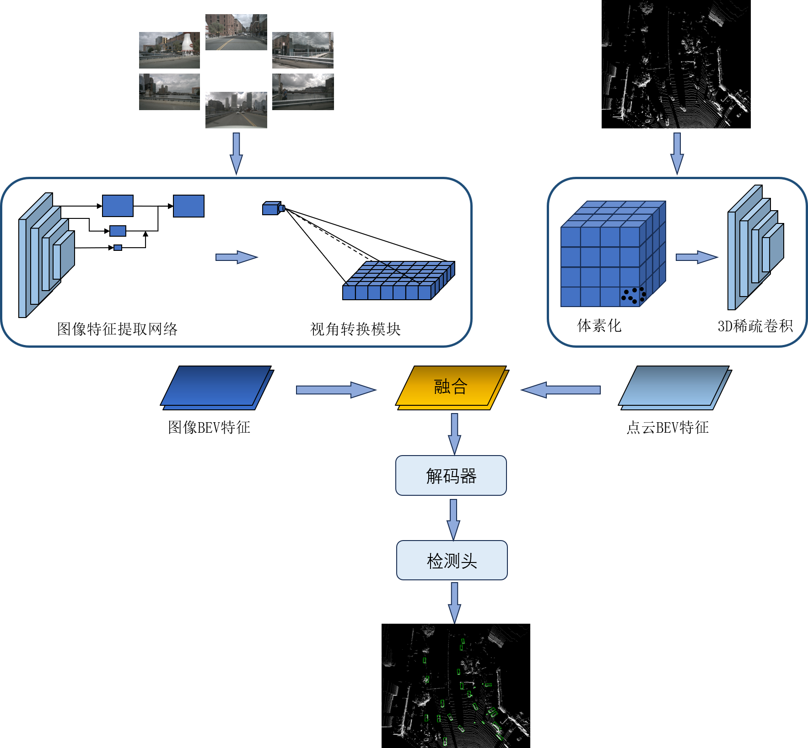

## Usage

### Prerequisites

The code is built with following libraries:

- Python >= 3.8, \<3.9
- OpenMPI = 4.0.4 and mpi4py = 3.0.3 (Needed for torchpack)
- Pillow = 8.4.0 (see [here](https://github.com/mit-han-lab/bevfusion/issues/63))
- [PyTorch](https://github.com/pytorch/pytorch) >= 1.9, \<= 1.10.2
- [tqdm](https://github.com/tqdm/tqdm)
- [torchpack](https://github.com/mit-han-lab/torchpack)
- [mmcv](https://github.com/open-mmlab/mmcv) = 1.4.0
- [mmdetection](http://github.com/open-mmlab/mmdetection) = 2.20.0
- [nuscenes-dev-kit](https://github.com/nutonomy/nuscenes-devkit)

After installing these dependencies, please run this command to install the codebase:

```bash
python setup.py develop
```

### Data Preparation

#### nuScenes

Please follow the instructions from [here](https://github.com/open-mmlab/mmdetection3d/blob/master/docs/en/datasets/nuscenes_det.md) to download and preprocess the nuScenes dataset. Please remember to download both detection dataset and the map extension (for BEV map segmentation). After data preparation, you will be able to see the following directory structure (as is indicated in mmdetection3d):

```
mmdetection3d
├── mmdet3d
├── tools
├── configs
├── data
│   ├── nuscenes
│   │   ├── maps
│   │   ├── samples
│   │   ├── sweeps
│   │   ├── v1.0-test
|   |   ├── v1.0-trainval
│   │   ├── nuscenes_database
│   │   ├── nuscenes_infos_train.pkl
│   │   ├── nuscenes_infos_val.pkl
│   │   ├── nuscenes_infos_test.pkl
│   │   ├── nuscenes_dbinfos_train.pkl

```

### Training

We provide instructions to reproduce our results on nuScenes.


Please run:
```bash
torchpack dist-run -np 8 python tools/train.py configs/nuscenes/det/transfusion_light/secfpn_fastBEV/camera+lidar_1layer/frozenResnet18_Voxelnet/convfuser.yaml --load_from pretrained/lidar-only-det.pth 
```

### checkpoint
[Detector_R18](https://drive.google.com/file/d/1RVuDPCrAnpWMOImo__6wLzhOctRL-Hfy/view?usp=drive_link)
### pretrained
[lidar-only-det.pth](https://drive.google.com/file/d/10T04WXpWlzYLp3rCvsd2yGJdCrA-Zrta/view?usp=drive_link)

### demo
#### [sunny](https://drive.google.com/file/d/1o2gRkADjCobh-Tuk9wGFoc-u-xPwdjsv/view?usp=drive_link)
#### [rainy](https://drive.google.com/file/d/1KF2oLEmueI-3Wqtuk4Be4cGFO3KeFOOT/view?usp=drive_link)


